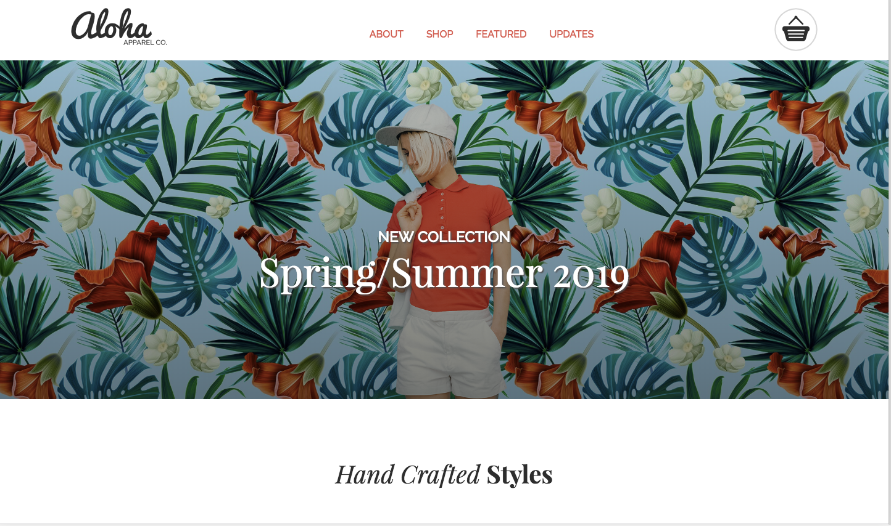
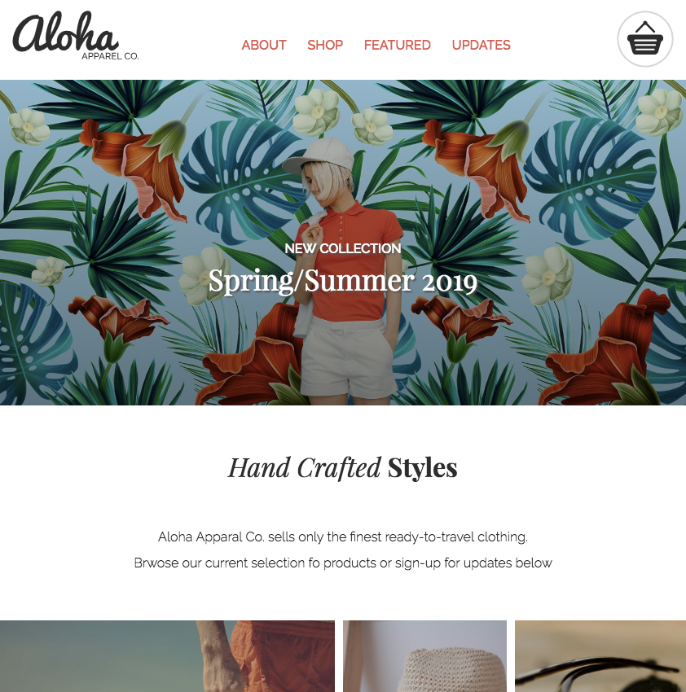
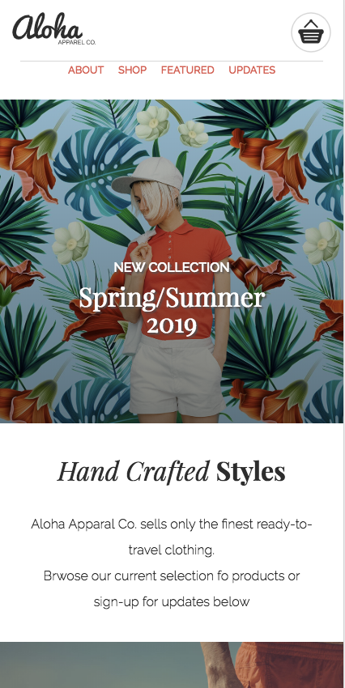

# Aloha Project README

**Version 1.0.0**

This is a shopping website that has a responsive design that can be displayed in three different ways depending on the device used (mobile, tablet, desktop).

## Screenshots

## Desktop

## Tablet

## Mobile

**Setup Instruction**

Go into repository and select latest version.

**Built With**

HTML - Framework of website

CSS - Styles for HTML

JavaScript - used for creating smooth scrolling, clothing carousel, and subscription alerts

Font Awesome - used for getting icons for Facebook, Twitter, Instagram, Pinterest, and Google+

Flickity - used for clothing carousel

Transfonter - used for getting fonts used for this website

**Author**

- Kyle Tecson

**Acknowledgements**

Thanks to all my classmates and instructors that helped me on this project.

**Things I Learned**

How to use flexbox.
How to create a responsive website.
